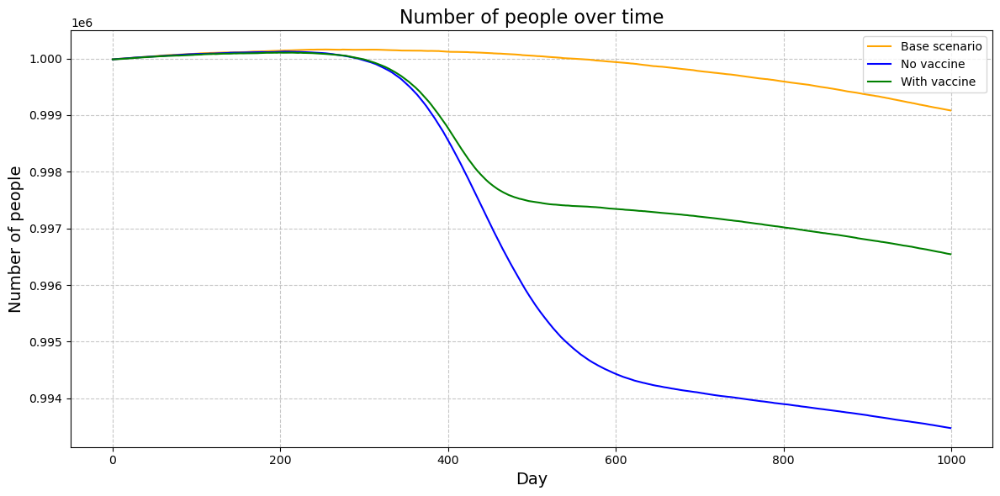

# Epidemic and Demographic Simulation in a Fictional Country

## What

This project simulates the demographic and epidemiological dynamics of a fictional country affected by an infectious disease. The model tracks the population structure by age and gender, simulates the spread of a disease, and includes mechanisms such as recovery, reinfection, death, vaccination, and natural demographic changes like aging and births. The simulation is run on a daily time step over multiple years.

## How

The simulation is implemented in Python and operates at an aggregated level (age group × gender × infection status). The core components include:

- **Population Structure**: The population is segmented by age brackets and gender. Aging is implemented annually using Poisson-distributed stochastic transitions between age groups.
- **Births and Natural Deaths**: 
  - Births occur daily based on annual fertility rates.
  - Natural deaths are determined by age- and gender-specific probabilities.
- **Disease Dynamics**:
  - **Primary Infections**: A fraction of the susceptible population becomes infected each day, based on age-specific probabilities and contact assumptions.
  - **Recovery and Mortality**: Infected individuals either recover or die according to age and day-of-infection-specific probabilities.
  - **Reinfections**: Recovered individuals can be reinfected at reduced probability.
  - **Vaccination**: A vaccination campaign begins on a predefined day (e.g., day 400), prioritizing older and uninfected individuals. Vaccinated persons use an alternative set of infection probabilities.
- **Stochasticity**: Core processes (births, deaths, infections, aging) use Poisson and normal distributions to introduce realistic randomness.

### Output

Two key visualizations are produced for each scenario:

#### 1. Total Population Over Time

Displays the total population for each day of the simulation under different scenarios (e.g., baseline, vaccination, increased mortality).

#### 2. Number of Infected Individuals Over Time

Tracks the number of currently infected individuals over time under each scenario.

Each scenario can be customized by adjusting input parameters such as infection probabilities, vaccination timing, or demographic rates.

## Why

This simulation was designed to explore the interaction between population dynamics and the spread of disease in a closed synthetic society. The main goals were:

- 📚 **Educational** — to understand how demographic structure influences disease spread and long-term outcomes.
- 🔬 **Exploratory** — to test intervention strategies like vaccination or altered mortality assumptions.
- 🧪 **Analytical** — to offer a controlled environment for studying "what-if" scenarios using realistic assumptions and randomized processes.

